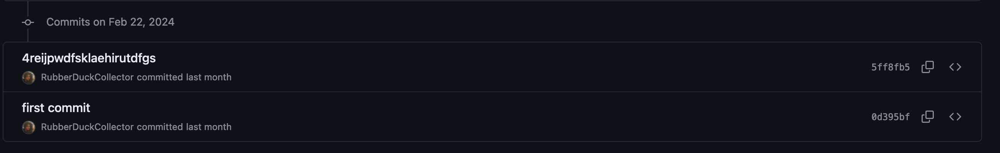

Table of contents:
<!-- vim-markdown-toc GFM -->

* [Subject resources](#subject-resources)
    * [Flash cards](#flash-cards)
        * [Languages](#languages)
            * [Dutch](#dutch)
            * [German](#german)
            * [Spanish](#spanish)
            * [Computer Science](#computer-science)
    * [Notes](#notes)
        * [Languages](#languages-1)
            * [Dutch](#dutch-1)
            * [German](#german-1)
            * [Spanish](#spanish-1)
* [To do](#to-do)

<!-- vim-markdown-toc -->

# Subject resources

This is a rolling-release collection of my notes and flash cards that I think are helpful

## Flash cards

*hello world*

**hello world**

***hello world***

Cards are stored in `cards/`.

Find the Quizlet forms of my cards [here!](https://quizlet.com/Eingabeaufforderung/folders)

For my own version of quizlet write, check out [quizlet-write](https://github.com/RubberDuckCollector/quizlet-write)

### Languages

- my flash card sets are more usable than the ones in the textbook.
    - e.g in spanish, the masculine + feminine forms of each adjective are in my cards in a more explicit format compared to the textbook
    - the male + female versions of nouns like *jefe* and *jefa* are much more explicit in my flash cards than the textbooks'
    - this makes it easier to recall feminine versions of words so they are given equal significance in the flash card set, which is not the case in the textbooks

#### Dutch

- Flash cards:
    - Cannot find any active GCSE or A level courses on Dutch in the UK. The closest I can find is an old OCR course however I haven't found any textbooks and the course was discontinued just before the switch from A*-U to 9-1.
        - Tell me instantly if you find a Dutch textbook from the UK. I know that UCL has a Dutch course and I've already applied to it.
    - Have fun with a sparratic mix of topics
    - Dutch flash cards have plurals for all nouns because it's a bit confusing

#### German

- Flash cards:
    - GCSE:
        - Cards are my own from AQA GCSE German Higher 9-1 (ISBN: 978-0-19-836587-7)
    - A Level:
        - AS:
            - Cards are my own from AQA A Level Year 1 and AS German (ISBN: 978-0-19-836689-8)
        - A2:
            - Cards are my own from AQA A Level Year 2 German (ISBN: 978-0-19-836686-7)

#### Spanish

- Will be responding to all AQA AS speaking cards
- unfortunately in the interest of doing what i'm good at i will be making them docx documents
    - (markdown rewrite coming someday?)
- i will still make them available here regardless. just don't want to use any proprietary standards

- Flash cards:
    - GCSE:
        - Cards are my own from AQA GCSE Spanish Higher 9-1 (ISBN: 978-0-19-836585-3)
    - A Level:
        - AS:
            - Cards are my own from AQA A Level Year 1 and AS Spanish (ISBN: 978-0-19-836690-4)
        - A2:
            - Cards are my own from AQA A Level Year 2 Spanish (ISBN: 978-0-19-836687-4)

#### Computer Science

- GCSE:
    - Cards are my own from OCR GCSE Computer Science 9-1 J277
- A level:
    - AS:
        - Cards are my own from OCR H046
    - A2:
        - Cards are my own from OCR H446

## Notes

### Languages

#### Dutch

#### German

#### Spanish

- Réquiem por un Campesino español
    - Version: from Manchester University Press
        - ISBN: 978-0-7190-3222-6
        - Has a dark green cover with yellow text and starts at page 47
    - quotes are arranged chronologically by the book's order
        - earlier quotes are at the top of each doc

Lovely..

# To do

