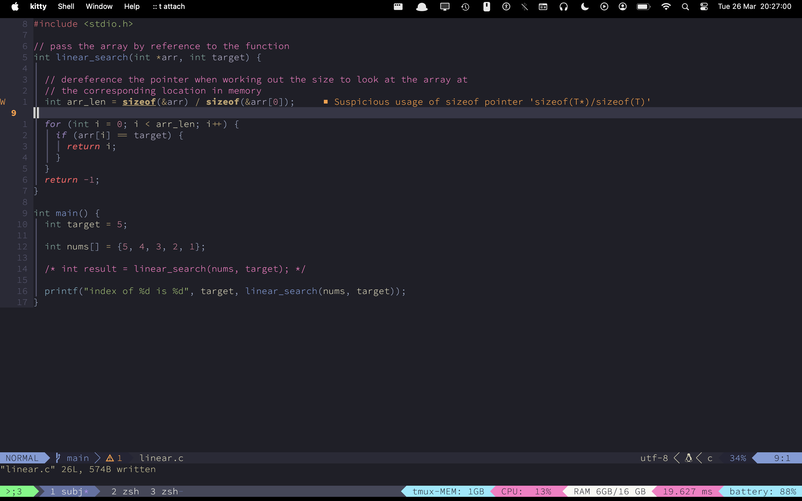

# Algorithms code examples

**2023-03-26**

- [ ] **If this box is unchecked, these code examples have not been fact checked by a teacher. If you're a teacher familiar with OCR H446, submit a pull request or email me! <eggsim49@gmail.com>**

<!-- vim-markdown-toc GFM -->

* [Search](#search)
    * [linear search](#linear-search)
        * [c](#c)
        * [python](#python)
        * [rust](#rust)
* [Sort](#sort)

<!-- vim-markdown-toc -->

For A Level: check out my [recursive binary search solution](search/binary/recursive-binary.py)

- i have python here but i'm also planning to expand to some examples for compiled languages, namely C and Rust
- to show that the logic is the same, the only differences in these algorithms will be idiomatic and use special techniques of a language. 
    - i.e the underlying theory will always be the same

# Search

## linear search

### c

if you know what's going on with the LSP message here, please tell me:

### python

### rust

# Sort
